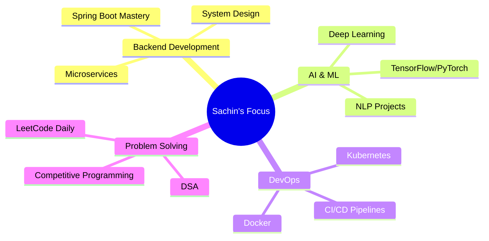

<!-- Animated Header -->
<p align="center">
  
</p>

<!-- Typing SVG with Updated Text -->
<p align="center">
  
</p>

<!-- Animated Coding GIF -->
<p align="center">
  
</p>

<!-- Profile Views Counter -->
<p align="center">
  
  
</p>

---

## 🚀 About Me


```javascript
const sachin = {
    role: "Full Stack Developer",
    focus: ["Backend Engineering", "System Design", "AI/ML"],
    currentlyLearning: ["Deep Learning", "NLP", "Advanced DSA"],
    technologies: {
        backend: ["Java", "Spring Boot", "Node.js", "Express"],
        frontend: ["React", "TailwindCSS", "JavaScript"],
        databases: ["MySQL", "MongoDB", "PostgreSQL"],
        devOps: ["Docker", "Kubernetes", "Git", "CI/CD"],
        aiML: ["TensorFlow", "PyTorch", "NLP", "Deep Learning"]
    },
    seeking: "SDE / Backend Developer Intern Roles",
    funFact: "I debug with console.log() and I'm not ashamed! 😄"
};
```

- 💼 **Full Stack Developer** focused on **Backend Engineering**
- 🚀 Building **Scalable & Production-ready Applications**
- 💻 Strong in **Java, Spring Boot, System Design, REST APIs**
- 🧠 Currently learning **Deep Learning & Natural Language Processing**
- 🌱 Improving **DSA & Competitive Programming** skills
- ☸️ Exploring **Kubernetes** for container orchestration
- 🤝 Looking for **SDE / Backend Developer Intern roles**
- 📫 Reach me: **contactbhagatsachin@gmail.com**

---

## 🔗 Connect With Me

<p align="center">
<a href="https://portfolio2-0-lemon-one.vercel.app/" target="_blank">
  
</a>
<a href="https://drive.google.com/file/d/1n3W-bKBjK7SLnPJMM_7BTSJKKm2Synsk/view" target="_blank">
  
</a>
<a href="mailto:contactbhagatsachin@gmail.com">
  
</a>
<a href="https://www.linkedin.com/in/sachinbhagat1617/" target="_blank">
  
</a>
<a href="https://github.com/SachinBhagat1617" target="_blank">
  
</a>
</p>

---

## 🛠️ Tech Stack & Tools

<details open>
<summary><b>🔧 Backend & Core</b></summary>
<br>
<p>


</p>
</details>

<details open>
<summary><b>🎨 Frontend</b></summary>
<br>
<p>


</p>
</details>

<details open>
<summary><b>🗄️ Databases</b></summary>
<br>
<p>


</p>
</details>

<details open>
<summary><b>☸️ DevOps & Tools</b></summary>
<br>
<p>


</p>
</details>

<details open>
<summary><b>🧠 AI/ML & Data Science (Learning)</b></summary>
<br>
<p>


</p>
</details>

---

## 🏆 GitHub Trophies

<p align="center">
  
</p>

---

## 📊 GitHub Statistics

<p align="center">
  
  
</p>

<p align="center">
  
</p>

<p align="center">
  
</p>

---

## 🏁 Competitive Programming

<p align="center">
<a href="https://leetcode.com/sachinbhagat/" target="_blank">
  
</a>
<a href="https://www.codechef.com/users/sachinbhagat" target="_blank">
  
</a>
<a href="https://codeforces.com/profile/sachinbhagat" target="_blank">
  
</a>
<a href="https://www.hackerrank.com/sachinbhagat" target="_blank">
  
</a>
</p>

<p align="center">
  
</p>

---

## 🐍 Contribution Snake

<picture>
  <source media="(prefers-color-scheme: dark)" srcset="https://raw.githubusercontent.com/SachinBhagat1617/SachinBhagat1617/output/github-contribution-grid-snake-dark.svg">
  <source media="(prefers-color-scheme: light)" srcset="https://raw.githubusercontent.com/SachinBhagat1617/SachinBhagat1617/output/github-contribution-grid-snake.svg">
  
</picture>

---

## 📈 Coding Activity

<!--START_SECTION:waka-->
<!--END_SECTION:waka-->

---

## 💡 Random Dev Quote

<p align="center">
  
</p>

---

## 🎯 Current Focus



---

## 🎮 When I'm Not Coding

```ascii
  _______________
 |  ___________  |
 | |           | |     → Building Side Projects
 | |   0   0   | |     → Learning New Technologies
 | |     -     | |     → Solving Coding Challenges
 | |   \___/   | |     → Contributing to Open Source
 | |___________| |     → Reading Tech Blogs
 |_______________|
```

---

## 📫 Let's Connect!

<p align="center">
  <i>💬 Feel free to reach out for collaborations, tech discussions, or just a friendly chat!</i>
</p>

<p align="center">
  
</p>

---

<p align="center">
  <i>⭐️ From <a href="https://github.com/SachinBhagat1617">SachinBhagat1617</a> with 💙</i>
</p>
